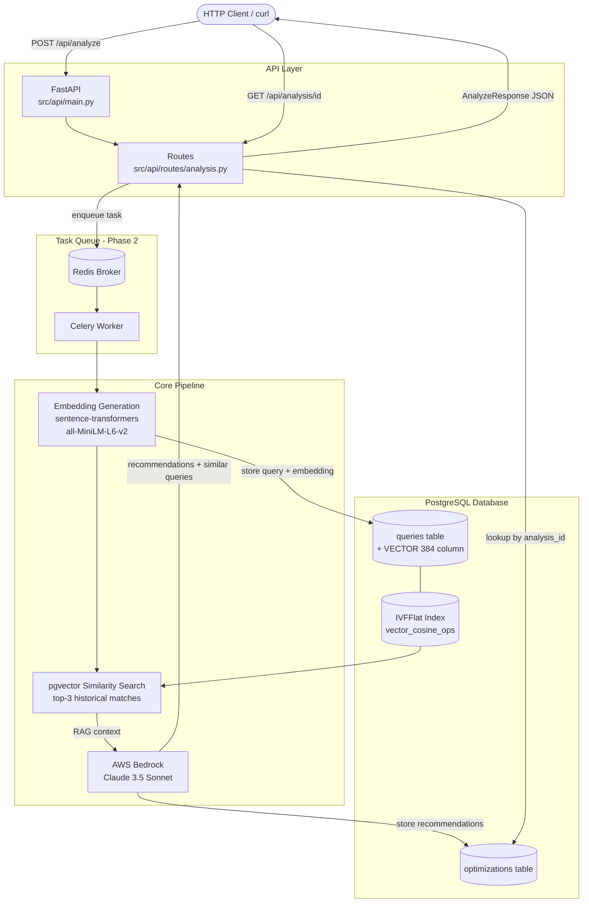
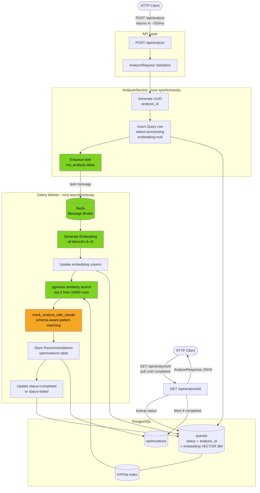
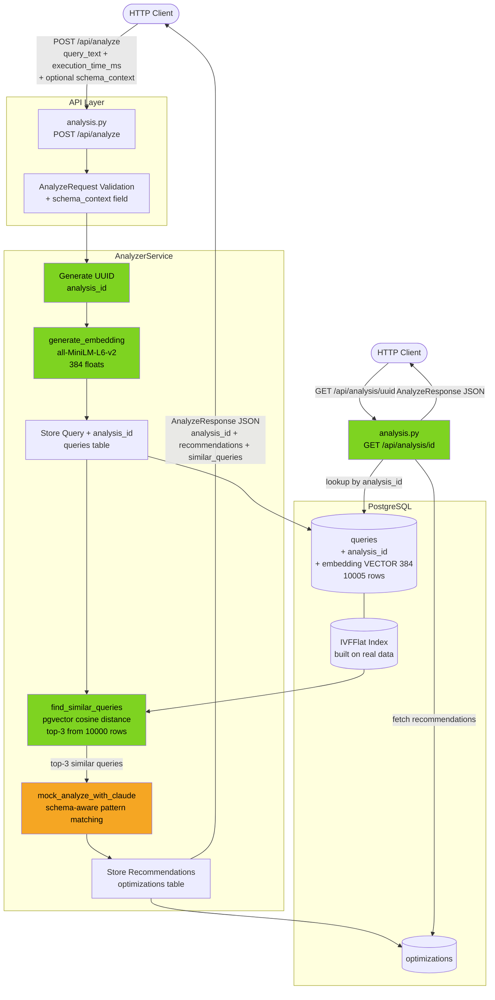
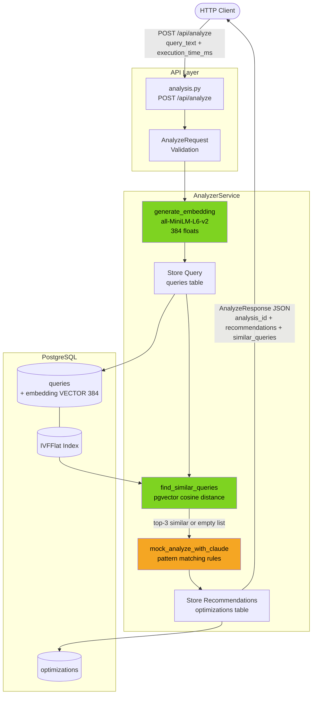

# QueryGenius — Architecture & Progress Log

This document tracks two things:
1. **Target Architecture** — the full intended system, unchanged across checkpoints
2. **Checkpoint Log** — dated snapshots of what is actually wired up, updated after every checkpoint commit

> Rule: Before every `git commit -m "checkpoint: ..."`, append a new entry to the Checkpoint Log below.

---

## Target Architecture

The complete system once all phases are done.



### Component Summary

| Component | Technology | Purpose |
|---|---|---|
| HTTP API | FastAPI | Receive queries, return analysis |
| Task Queue | Celery + Redis | Async processing (Phase 2) |
| Embeddings | sentence-transformers `all-MiniLM-L6-v2` | Convert SQL text to 384-dim vectors |
| Vector Search | pgvector (`<->` cosine distance) | Find historically similar queries |
| LLM Analysis | AWS Bedrock — Claude 3.5 Sonnet | Generate optimization recommendations |
| Database | PostgreSQL 15 + pgvector | Store everything in one place |

### Full Data Flow (Target)

```
POST /api/analyze
  → validate request (Pydantic)
  → enqueue Celery task
    → generate embedding (sentence-transformers)
    → store query + embedding in queries table
    → pgvector search: find top-3 similar historical queries
    → build RAG prompt (query + schema context + similar history)
    → call Claude 3.5 Sonnet via AWS Bedrock (over PrivateLink)
    → parse recommendations
    → store recommendations in optimizations table
  → return AnalyzeResponse (analysis_id, recommendations, similar_queries)

GET /api/analysis/{id}
  → lookup analysis_id in database
  → return stored AnalyzeResponse
```

---

## Deployment Architecture & Security Model

This section documents how QueryGenius is intended to be deployed in a production
environment, and the reasoning behind the network design decisions.

### Why QueryGenius is a sidecar, not embedded

QueryGenius never connects directly to the application database. It receives query
text and execution time as input over HTTP, and returns recommendations as output.
The application database is never touched. This means:

- Zero changes required to the ticketing app (or any other source app)
- Blast radius of a QueryGenius compromise does not reach application data
- Any app that can make an HTTP call can use QueryGenius

### Network Topology

```
┌─────────────────────────────────────────────────────────────┐
│                       GitHub Actions                         │
│  Runs test suite, collects slow queries, POSTs to           │
│  QueryGenius via VPN tunnel or self-hosted runner            │
└──────────────────────────┬──────────────────────────────────┘
                           │ HTTPS over VPN / private tunnel
                           │ (query text + schema context)
           ┌───────────────▼─────────────────────────────────┐
           │                  VPC (company)                   │
           │                                                  │
           │  ┌───────────────────────────────────────────┐   │
           │  │  Private Subnet A — Application           │   │
           │  │  - App servers (e.g. movie ticketing)     │   │
           │  │  - Application PostgreSQL DB              │   │
           │  │  No public IP. Not reachable from         │   │
           │  │  internet directly.                       │   │
           │  └────────────────────┬──────────────────────┘   │
           │                       │ VPC-internal traffic only │
           │                       │ (slow query logs +        │
           │                       │  schema context)          │
           │  ┌────────────────────▼──────────────────────┐   │
           │  │  Private Subnet B — QueryGenius           │   │
           │  │  - FastAPI server                         │   │
           │  │  - QueryGenius PostgreSQL + pgvector      │   │
           │  │  - Embedding model (sentence-transformers)│   │
           │  │  No public IP. Accepts inbound only from  │   │
           │  │  Subnet A and VPN tunnel.                 │   │
           │  └────────────────────┬──────────────────────┘   │
           │                       │ Outbound via PrivateLink  │
           └───────────────────────┼─────────────────────────-┘
                                   │
           ┌───────────────────────▼─────────────────────────┐
           │         AWS PrivateLink (VPC Interface Endpoint) │
           │  Traffic stays on AWS internal backbone.         │
           │  Never traverses the public internet.            │
           └───────────────────────┬─────────────────────────┘
                                   │
           ┌───────────────────────▼─────────────────────────┐
           │              AWS Bedrock (Claude 3.5 Sonnet)     │
           │  - Receives: query + schema context + RAG        │
           │  - Returns: recommendations                      │
           │  - Does not train on customer prompts            │
           │  - Covered by AWS SOC 2, ISO 27001, HIPAA        │
           └─────────────────────────────────────────────────┘
```

### What each subnet contains and why they are separate

| Subnet | Contents | Inbound allowed from | Outbound allowed to |
|---|---|---|---|
| Subnet A (Application) | App servers, application DB | Internal app traffic only | Subnet B only |
| Subnet B (QueryGenius) | FastAPI, pgvector DB, embedding model | Subnet A, VPN/GitHub runner | AWS Bedrock via PrivateLink only |

Subnets are separated by **least privilege**: if Subnet B is compromised, the attacker
still cannot reach the application database in Subnet A. The blast radius is contained.

### AWS PrivateLink — why Bedrock is not "on the public internet"

AWS Bedrock is a managed service and does not run inside your VPC. However, AWS
PrivateLink creates a **VPC Interface Endpoint** that makes Bedrock reachable over
AWS's internal backbone network — traffic never leaves AWS infrastructure and never
touches the public internet.

```
Without PrivateLink:   Subnet B → Internet Gateway → Public Internet → Bedrock
With PrivateLink:      Subnet B → VPC Endpoint → AWS Internal Network → Bedrock
```

This closes the last external exposure gap in the network design.

### GitHub Actions integration

GitHub Actions runners live outside your VPC. Two approaches for connecting them:

**Option 1 — VPN Gateway (simpler to set up)**
The VPC exposes a VPN endpoint. The CI job connects via OpenVPN or WireGuard at
workflow start, making the runner behave as if it is inside the VPC for the duration
of the job.

**Option 2 — Self-hosted Runner in Subnet B (more secure)**
The GitHub Actions runner itself runs as a process inside Subnet B. No tunnel needed.
The runner is already on the private network. Preferred for sensitive environments.

### End-to-end CI/CD data flow

```
1. GitHub Actions: run test suite against test DB in Subnet A
      → pg_stat_statements collects slow queries during test run

2. GitHub Actions: second job (via VPN or self-hosted runner)
      → reads slow query logs from pg_stat_statements
      → pulls schema via pg_catalog (read-only introspection)
      → POSTs to QueryGenius in Subnet B:
         { query_text, execution_time_ms, schema_context }

3. QueryGenius (Subnet B):
      → generates embedding for the query
      → searches pgvector for similar historical queries
      → builds RAG prompt: query + schema + similar history
      → sends to AWS Bedrock via PrivateLink (never public internet)

4. AWS Bedrock returns recommendations to Subnet B

5. QueryGenius stores recommendations and returns AnalyzeResponse

6. GitHub Actions posts recommendations as a PR comment
      → developer sees query regressions before they hit production
```

### Schema context in prompts

Passing schema context to Claude significantly improves recommendation quality.
Without it, Claude can only guess column names and types. With it:

```
<schema>
  Table: bookings (id SERIAL, seat_id INT FK, status VARCHAR(20), created_at TIMESTAMP)
  Table: seats (id SERIAL, movie_id INT FK, row CHAR(1), number INT)
  Existing indexes: bookings_pkey, seats_pkey, idx_seats_movie_id
</schema>
<query>
  SELECT * FROM bookings JOIN seats ON bookings.seat_id = seats.id
  WHERE seats.movie_id = 42 AND bookings.status = 'confirmed'
</query>
```

Claude can then recommend the exact index, with correct column names, aware of what
indexes already exist. Schema is pulled via `pg_catalog` (read-only) at analysis time
and included in the prompt. It travels Subnet A → Subnet B on internal network, then
Subnet B → Bedrock over PrivateLink. It is never exposed to the public internet.

### Security properties of this design

| Threat | Mitigation |
|---|---|
| External attacker reaching QueryGenius | No public IP on Subnet B — unreachable from internet |
| DOS attack on QueryGenius | No public surface to attack |
| MitM on Bedrock traffic | PrivateLink — traffic never on public internet |
| Schema leak via prompt interception | PrivateLink + TLS — no public internet hop |
| AWS training on customer prompts | AWS Bedrock policy: prompts not used for training |
| Internal misconfiguration / credential leak | Biggest real risk — mitigated by secrets management, IAM roles, no hardcoded keys |
| Subnet B compromise reaching Subnet A DB | Subnet separation — Subnet B has no route to Subnet A DB |

---

## Checkpoint Log

Entries are newest-first. Each entry shows what is real, what is mocked, and the actual data flow at that point in time.

---

### Checkpoint: Day 3 — 2026-05-26

**Commits:**
- `fix: Add analysis_id generation to seed_data.py`
- `docs: Add README with full setup guide, demo commands, and portfolio notes`
- `refactor: Remove unused btree index on queries.query_text`
- `feat: Add Celery + Redis async task queue for analysis pipeline`

#### What is real vs mocked

| Component | Status | Notes |
|---|---|---|
| FastAPI app + CORS | Real | Running, auto-docs at `/docs` |
| `POST /api/analyze` route | Real | Returns in ~250ms with `status=processing` |
| `GET /api/analysis/{id}` route | Real | Returns `processing`, `completed`, or `failed` |
| Pydantic request/response models | Real | Includes optional `schema_context` field |
| `analysis_id` UUID storage | Real | Generated at submit time, stored immediately |
| `status` column on queries | Real | Tracks `processing` → `completed` / `failed` |
| PostgreSQL connection | Real | SQLAlchemy engine + session DI |
| `queries` + `optimizations` tables | Real | `status` column added, `embedding` nullable |
| pgvector + IVFFlat index | Real | Built on 10,000 real rows |
| Embedding generation | Real | `all-MiniLM-L6-v2`, 384-dim, runs inside Celery task |
| pgvector similarity search | Real | Cosine distance, threshold 0.7, top-3 |
| Redis message broker | Real | Holds task queue between FastAPI and Celery |
| Celery async worker | Real | `--pool=solo` on Mac; `prefork` on Linux/production |
| Exponential backoff on failure | Real | 3 retries: 2s, 4s, 8s delays |
| Schema context in prompts | Real | `fetch_schema_from_db()` + prompt injection |
| LLM / AI recommendations | **Mocked** | Pattern-matching rules, no Bedrock call yet |
| AWS Bedrock integration | **Not started** | No credentials wired — one import swap needed |
| pytest suite | **Not started** | Phase 2 |
| GitHub Actions CI/CD | **Not started** | Phase 2 |
| README | Real | Full setup guide, demo commands, interview talking points |

#### What changed since Day 2

**Celery + Redis async pipeline**
The biggest change. POST `/api/analyze` no longer blocks — it inserts the
query row immediately with `status=processing` and `embedding=null`, enqueues
the task in Redis, and returns in ~250ms. The Celery worker picks up the task
independently and runs the full pipeline: embedding generation → pgvector search
→ LLM → store recommendations → mark `status=completed`. On failure, the task
retries up to 3 times with exponential backoff (2s, 4s, 8s) before marking
`status=failed`. Clients poll `GET /api/analysis/{id}` until status changes.

**DB schema changes**
- `status VARCHAR(20)` added to `queries` — default `processing`, updated to
  `completed` or `failed` by the Celery task
- `embedding` made nullable — the row is inserted before embedding is generated

**Seed script + index cleanup**
- `seed_data.py` fixed to include `analysis_id` per row (was causing NOT NULL violation)
- Unused btree index on `query_text` removed — only used access patterns are
  vector search (IVFFlat) and ID/analysis_id lookup (btree)

**README**
Full project README added with setup guide, curl demo examples, RAG pipeline
explanation, Bedrock migration path, and interview talking points.

#### Current Data Flow



**Orange** = mocked. **Green** = real and working.

#### How to run at this checkpoint

```bash
# Terminal 1 — Redis
redis-server

# Terminal 2 — Celery worker (use --pool=solo on Mac with system Python 3.9)
python3 -m celery -A src.core.celery_app:celery_app worker --loglevel=info --pool=solo

# Terminal 3 — FastAPI
python3 -m uvicorn src.api.main:app --reload --port 8000

# Submit a query — returns instantly
curl -X POST http://localhost:8000/api/analyze \
  -H "Content-Type: application/json" \
  -d '{"query_text": "SELECT * FROM bookings WHERE status LIKE '\''%confirmed%'\''", "execution_time_ms": 2300}'

# Poll for results (replace with your analysis_id)
curl http://localhost:8000/api/analysis/<analysis_id>
```

#### What comes next (Phase 2 remaining)

- Replace mock LLM with real AWS Bedrock (one import swap once credentials available)
- Write pytest suite — happy path, edge cases, error cases for all services
- GitHub Actions CI/CD workflow — run tests, collect slow queries, post PR comments

---

### Checkpoint: Day 2 — 2026-05-25

**Commits:**
- `feat: Add analysis_id storage, GET retrieval, and seed data script`
- `feat: Add schema context to LLM prompts for precise recommendations`

#### What is real vs mocked

| Component | Status | Notes |
|---|---|---|
| FastAPI app + CORS | Real | Running, auto-docs at `/docs` |
| `POST /api/analyze` route | Real | Fully wired end-to-end |
| `GET /api/analysis/{id}` route | Real | Retrieves stored analysis by UUID |
| Pydantic request/response models | Real | Now includes optional `schema_context` field |
| `analysis_id` (UUID) storage | Real | Generated at request start, stored in `queries` table |
| PostgreSQL connection | Real | SQLAlchemy engine + session DI |
| `queries` table + `optimizations` table | Real | `analysis_id` column added (VARCHAR 36, unique, indexed) |
| pgvector extension + IVFFlat index | Real | Rebuilt on 10,000 real rows — meaningful clusters |
| Embedding generation | Real | `all-MiniLM-L6-v2`, 384-dim, lazy-loaded |
| pgvector similarity search | Real | Cosine distance, threshold 0.7, top-3 — now returns real results |
| Seed data | Real | 10,000 queries across 15 slow-query patterns, batch encoded and inserted |
| Schema context in prompts | Real | `fetch_schema_from_db()` introspects `pg_catalog`; passed through request → LLM |
| `build_analysis_prompt()` | Real | Structured prompt with schema + RAG context ready for Bedrock in Phase 2 |
| LLM / AI recommendations | **Mocked** | Pattern-matching rules, but now schema-aware (exact column names, index dedup) |
| Celery async task queue | **Not started** | All processing is synchronous |
| Redis | **Not started** | No broker configured |
| AWS Bedrock integration | **Not started** | No credentials wired — mock in place |

#### What changed since Day 1

**`analysis_id` lifecycle fixed**
Previously a UUID was generated at response time and thrown away — impossible to
retrieve later. Now generated at the start of the POST call, stored in the `queries`
table, and the same value returned in the response. `GET /api/analysis/{id}` looks
it up and reconstructs the response from stored `optimizations` rows.

**Seed data**
10,000 sample slow queries inserted covering 15 anti-patterns (full table scans,
LIKE wildcards, multi-JOINs, NOT IN subqueries, function-on-indexed-column, etc.).
Embeddings batch-encoded (256 per batch) and bulk-inserted (500 per transaction).
IVFFlat index rebuilt after insert so cluster centroids reflect real data.

**Schema context**
`AnalyzeRequest` now accepts an optional `schema_context` list. `src/utils/parsers.py`
provides `fetch_schema_from_db()` to pull table/column/index info from any PostgreSQL
database via `information_schema` and `pg_catalog`. The mock LLM uses this to:
- Name exact columns in index SQL (`ON bookings USING gin(status gin_trgm_ops)`)
- List actual column names in SELECT * rewrites
- Skip indexes that already exist in the schema

#### Current Data Flow



**Orange** = mocked component. **Green** = real and working.

#### How to run at this checkpoint

```bash
# First time only — seed the database
python3 scripts/seed_data.py

# Start the API
python3 -m uvicorn src.api.main:app --reload --port 8000

# Submit a query without schema context
curl -X POST http://localhost:8000/api/analyze \
  -H "Content-Type: application/json" \
  -d '{"query_text": "SELECT * FROM bookings WHERE status LIKE '\''%confirmed%'\''", "execution_time_ms": 2300}'

# Submit a query with schema context (precise recommendations)
curl -X POST http://localhost:8000/api/analyze \
  -H "Content-Type: application/json" \
  -d '{
    "query_text": "SELECT * FROM bookings WHERE status LIKE '\''%confirmed%'\''",
    "execution_time_ms": 2300,
    "schema_context": [
      {
        "table": "bookings",
        "columns": [
          {"name": "id", "type": "integer", "nullable": false},
          {"name": "status", "type": "character varying", "nullable": false}
        ],
        "indexes": [{"name": "bookings_pkey", "columns": ["id"], "unique": true}]
      }
    ]
  }'

# Retrieve a previous analysis by its UUID
curl http://localhost:8000/api/analysis/<analysis_id>
```

#### What comes next (Day 3 targets)

- Replace mock LLM with real AWS Bedrock call (Phase 2)
- Add Celery + Redis for async processing (Phase 2)
- Write pytest suite covering happy path, edge cases, error cases (Phase 2)
- README with full demo instructions and architecture summary

---

### Checkpoint: Day 1 MVP — 2026-05-24

**Commit:** `feat: Complete Day 1 MVP - Core QueryGenius functionality`

#### What is real vs mocked

| Component | Status | Notes |
|---|---|---|
| FastAPI app + CORS | Real | Running, auto-docs at `/docs` |
| `POST /api/analyze` route | Real | Fully wired end-to-end |
| `GET /api/analysis/{id}` route | Stub | Returns 404 — retrieval not implemented |
| Pydantic request/response models | Real | Validation, destructive query blocking |
| PostgreSQL connection | Real | SQLAlchemy engine + session DI |
| `queries` table + `optimizations` table | Real | Created via `scripts/setup_db.py` |
| pgvector extension + IVFFlat index | Real | Created at DB setup time |
| Embedding generation | Real | `all-MiniLM-L6-v2`, 384-dim, lazy-loaded |
| pgvector similarity search | Real | Cosine distance, threshold 0.7, top-3 |
| LLM / AI recommendations | **Mocked** | Pattern-matching rules, no Bedrock call |
| Celery async task queue | **Not started** | All processing is synchronous |
| Redis | **Not started** | No broker configured |
| AWS Bedrock integration | **Not started** | No credentials wired |
| Seed data | **Not started** | Database starts empty |
| `GET /api/analysis/{id}` retrieval | **Not started** | Returns 404 always |

#### Current Data Flow



**Orange** = mocked component. **Green** = real and working.

#### What the mock LLM does

Since Bedrock is not connected, `src/services/llm.py` inspects the query text for patterns:

- `LIKE '%...` → recommends GIN trigram index
- No `WHERE` clause → recommends adding a filter
- `SELECT *` → recommends selecting specific columns
- `JOIN` present → recommends index on join columns
- Similar history found → references the historical match
- No pattern matched → suggests running `EXPLAIN ANALYZE`

#### How to run at this checkpoint

```bash
# Start the API
uvicorn src.api.main:app --reload --port 8000

# Submit a query for analysis
curl -X POST http://localhost:8000/api/analyze \
  -H "Content-Type: application/json" \
  -d '{"query_text": "SELECT * FROM users WHERE email LIKE '"'"'%@gmail.com'"'"'", "execution_time_ms": 1850}'

# View auto-generated API docs
open http://localhost:8000/docs
```

#### What comes next (Day 2 targets)

- Seed database with sample queries so similarity search returns real results
- Implement `GET /api/analysis/{id}` retrieval from the database
- Wire AWS Bedrock (or keep mock until credentials available)
